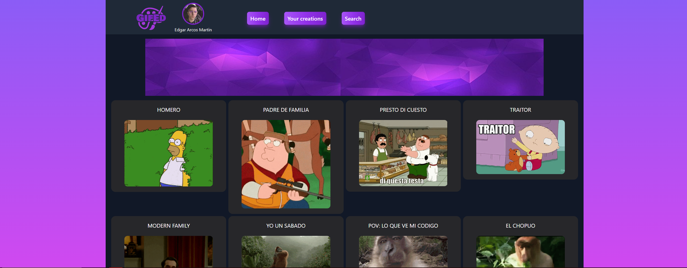
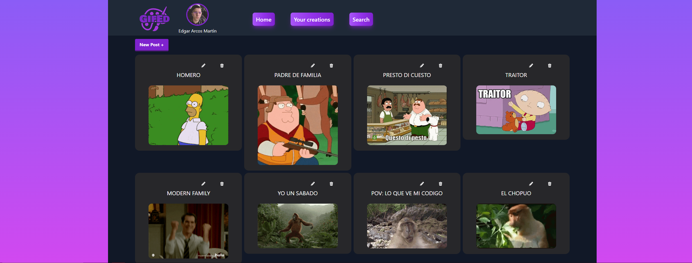
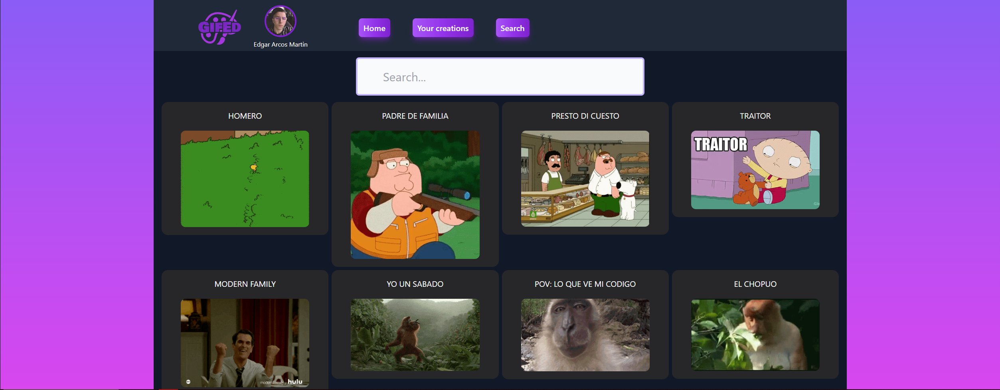

# GifEd
###### Creado por: Edgar Arcos Martin

## Descripcion

GifEd es una web con CRUD basico,gestion de usuarios mediante auth0 y un buscador todo apoyado en una base de datos NoSQL (no relacional) donde se guardan los distintos posts asignados al usuario que la creo

El objetivo es crear una web donde guardar tus memes o gifs todo de contenido de humor y ver el contenido de otros para luego compartirlos con tus amigos

Futuras Implementaciones: 

Poder seguir otros usuarios crear algun tipo de filtro para los distintos posts y gestion de estadisticas 

## Tecnologias y librerias usadas

* Cloudinary
* Cors
* Dotenv
* Express
* Express-fileupload
* fs-extra
* helmet
* http-errors
* mongoose
* morgan
* nodemon

## Instalar y ejecutar proyecto

1. Descargar [Visual Studio Code](https://code.visualstudio.com)
2. Descargar [MongoDB](https://www.mongodb.com/products/compass)
2. Descargar Repositorio
3. Descargar [Postman](https://www.postman.com)
4. Descargar [NPM](https://www.npmjs.com)
4. Abir Visual Studio Code
5. Abrir desde Visual Studio Code el repositorio previamente descargado
6. Abrir la consola y ejecutar el comando npm i (se instalara todas las librerias anteriormente dichas)
7.Crear una base de datos y rellenar tu punto env con las credenciales necesarias
7. Ejecutar npm run dev para que arranque el aplicacion
8. Hacer las pruebas que requiera con Postman o ThunderClient

## Imagenes Gifed

https://github.com/EdgarArcos/PruebaTecnica-Backend/assets/119437039/3dcad49f-ce46-4860-b5fd-107690e578f5

